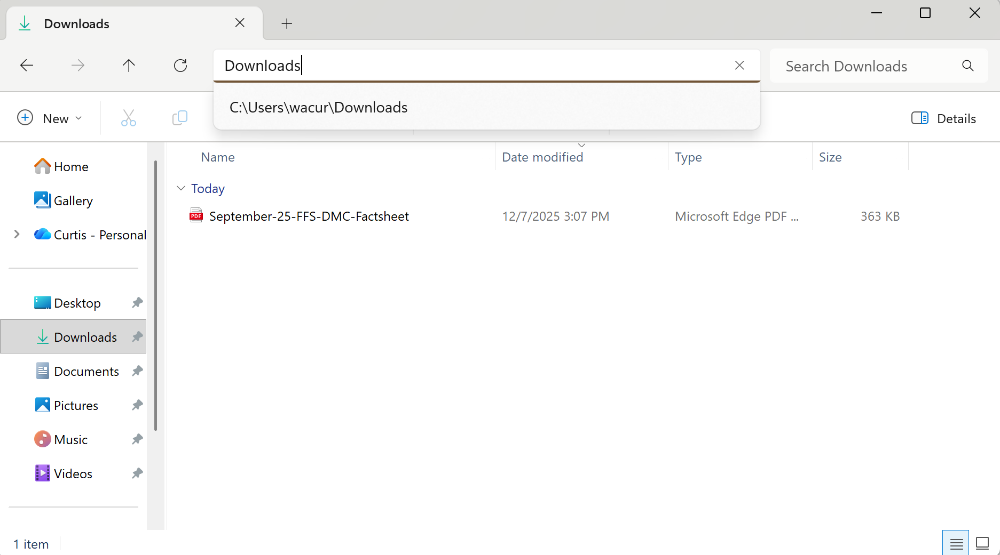

# 1. Automation Project – Python & Selenium

## 1.1 Objective

Automate the retrieval of the latest **Dental FFS and DMC Performance Fact Sheet** from the California Department of Health Care Services (DHCS) website using Python and Selenium. :contentReference[oaicite:3]{index=3}  

Business-style goal:

> Build a reliable, repeatable automation that simulates a user navigating the DHCS website, locating the latest dental performance report, downloading the PDF, and terminating the session.

---

## 1.2 Hypothetical Business Purpose

You are working as a **systems or data analyst** for a state health agency (or a consulting team supporting them) that regularly reviews DHCS dental performance reports. Currently, analysts:

- Manually navigate to the DHCS website.
- Locate the latest *Dental FFS and DMC Performance Fact Sheet*.
- Download the PDF.
- Store it locally or on a shared drive for further analysis.

This manual workflow is:

- Time-consuming,
- Error-prone,
- Difficult to scale as reporting frequency or number of stakeholders grows. :contentReference[oaicite:4]{index=4}  

To improve efficiency and reliability, the team wants an automated process that:

- Opens a browser session in a controlled, repeatable way.
- Navigates directly to the DHCS Dental Reports page.
- Identifies the most recent **Dental FFS and DMC Performance Fact Sheet**.
- Downloads the PDF to a known directory without manual interaction.
- Terminates the browser session cleanly once the file is downloaded.

The resulting automation could be scheduled (cron, task scheduler, CI/CD) to run weekly or monthly, ensuring downstream reporting and dashboards always have the latest DHCS dental performance data.

---

## 1.3 High-Level Automation Flow

The Selenium automation performs the following steps:

1. **Configure Chrome WebDriver**

   - Set a custom `downloads/` directory.
   - Disable download prompts.
   - Configure Chrome to automatically download PDFs instead of opening them in the browser.

2. **Open the DHCS website**

   - Start a Chrome browser session.
   - Navigate to the DHCS home page:  
     `https://www.dhcs.ca.gov/`

3. **Navigate to the Dental Reports page**

   - Load the target page directly:  
     `https://www.dhcs.ca.gov/services/Pages/DentalReports.aspx`

4. **Locate the latest Dental FFS and DMC Performance Fact Sheet**

   - Search for a link whose text contains  
     `"Dental FFS and DMC Performance Fact Sheet - September 2025"` (for this exercise).
   - Extract the `href` attribute to determine the expected filename of the PDF.

5. **Download the latest report**

   - Click the link to trigger the download.
   - Poll the `downloads/` directory until:
     - The target file appears, and
     - No `.crdownload` temporary files remain (download complete).

6. **Terminate the script**

   - Close the browser (`driver.quit()`).
   - Confirm that the file exists in the local `downloads/` folder.

---

## 1.4 Python & Selenium Script (for reference)

This script is **not required to run** for the portfolio; it is included purely to show implementation detail.

```python
"""
Install dependencies (run once):
pip install selenium webdriver-manager
"""

import os
import time
from pathlib import Path
from urllib.parse import urlparse

from selenium import webdriver
from selenium.webdriver.chrome.service import Service
from selenium.webdriver.chrome.options import Options
from selenium.webdriver.common.by import By
from selenium.webdriver.support.ui import WebDriverWait
from selenium.webdriver.support import expected_conditions as EC
from webdriver_manager.chrome import ChromeDriverManager


DHCS_HOME_URL = "https://www.dhcs.ca.gov/"
DENTAL_REPORTS_URL = "https://www.dhcs.ca.gov/services/Pages/DentalReports.aspx"
REPORT_LINK_TEXT = "Dental FFS and DMC Performance Fact Sheet - September 2025"


def configure_chrome(download_dir: Path) -> webdriver.Chrome:
    """Configure Chrome so that PDF files are downloaded automatically."""
    chrome_options = Options()

    # Optional: run headless
    # chrome_options.add_argument("--headless=new")

    prefs = {
        "download.default_directory": str(download_dir),
        "download.prompt_for_download": False,
        "download.directory_upgrade": True,
        "plugins.always_open_pdf_externally": True,
    }
    chrome_options.add_experimental_option("prefs", prefs)

    driver = webdriver.Chrome(
        service=Service(ChromeDriverManager().install()),
        options=chrome_options,
    )
    driver.maximize_window()
    return driver


def wait_for_download(download_dir: Path, expected_filename: str, timeout: int = 60) -> Path:
    """Wait until the expected file is fully downloaded."""
    expected_path = download_dir / expected_filename
    end_time = time.time() + timeout

    while time.time() < end_time:
        partial = list(download_dir.glob("*.crdownload"))
        if expected_path.exists() and not partial:
            return expected_path
        time.sleep(1)

    raise TimeoutError(f"Download did not complete within {timeout} seconds.")


def main():
    download_dir = Path.cwd() / "downloads"
    download_dir.mkdir(exist_ok=True)

    driver = configure_chrome(download_dir)
    wait = WebDriverWait(driver, 20)

    try:
        driver.get(DHCS_HOME_URL)
        driver.get(DENTAL_REPORTS_URL)

        latest_link = wait.until(
            EC.element_to_be_clickable(
                (By.PARTIAL_LINK_TEXT, REPORT_LINK_TEXT)
            )
        )

        href = latest_link.get_attribute("href")
        parsed = urlparse(href)
        pdf_filename = os.path.basename(parsed.path)

        print(f"Found latest report URL: {href}")
        print(f"Expected downloaded filename: {pdf_filename}")

        latest_link.click()

        downloaded_path = wait_for_download(download_dir, pdf_filename)
        print(f"Download completed: {downloaded_path}")

    finally:
        driver.quit()


if __name__ == "__main__":
    main()
```



