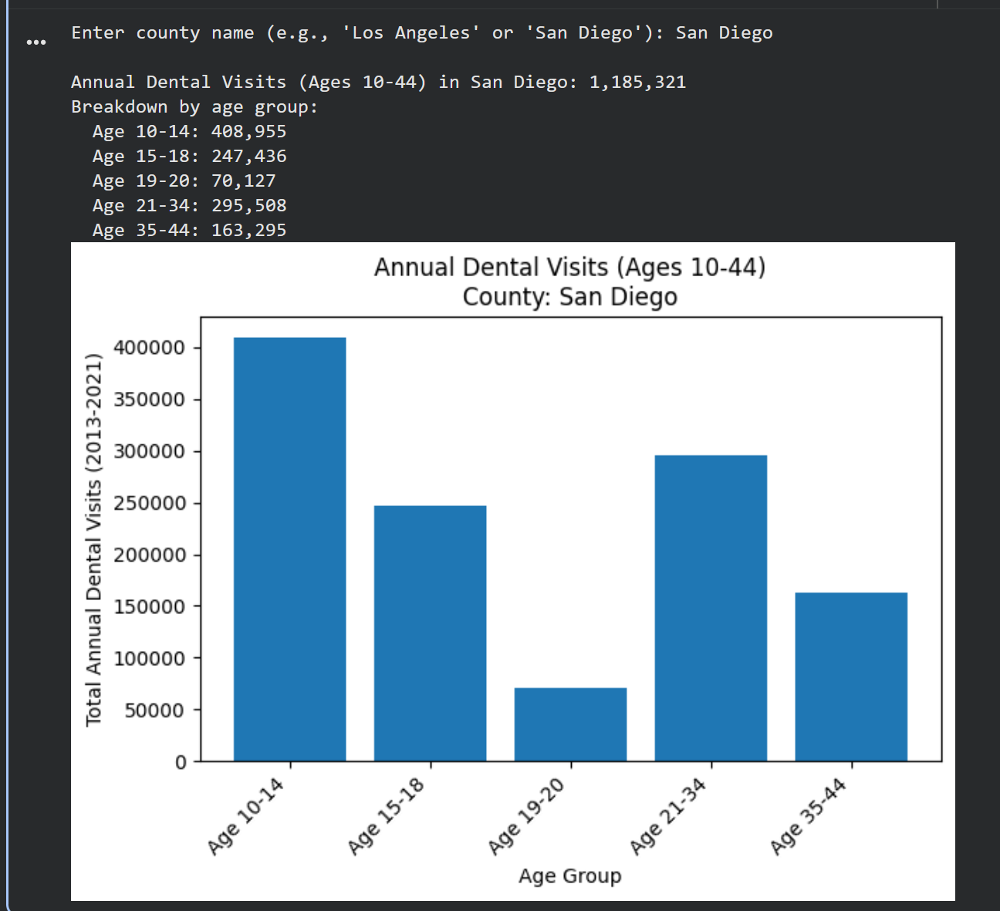

# HealthCare Project – Testing Framework (Python & BigQuery)

### 1. Objective

Design and document a simple testing framework to validate a Python script that queries BigQuery and visualizes the total number of **Annual Dental Visits (ADV)** for **Ages 10–44** by county.

The tests cover:

- Valid counties: **Los Angeles** and **San Diego**.
- Invalid inputs:
  - Misspelled or non-existent county.
  - County that exists but is **outside California**.

This document focuses on **behavior and test cases**, not on running the script in a live environment.

---

### 2. Hypothetical Business Purpose

You are a systems or data analyst working with **California DHCS dental utilization data**. To support program managers and stakeholders, you have created a Python script that:

- Connects to **BigQuery**.
- Retrieves **Annual Dental Visits** for key age groups (10–44).
- Produces a **bar chart** for a given county.
- Handles invalid input with clear error messages.

Non-technical users (managers, policy analysts) might run this script to quickly understand utilization for a specific county without writing SQL or interacting with BigQuery directly.

To ensure predictable and reliable behavior, you define a small **manual testing framework**:

- Confirm that valid inputs produce correct visualizations (happy paths).
- Confirm that invalid inputs produce the intended error messages (negative tests).

This mirrors how a junior systems analyst or QA engineer would document tests for a data/analytics tool.

---

## 3. Python Script Under Test (Conceptual Implementation)

The script:

- Prompts the user for a **county name**.
- Loads valid **California county names** from `mdsd_clean`.
- Queries `dental_joined_periods` for **Annual Dental Visits (ADV)** for Ages 10–44:
  - Age 10–14  
  - Age 15–18  
  - Age 19–20  
  - Age 21–34  
  - Age 35–44
- Aggregates visits for these age bands and displays:
  - A **numeric total**.
  - A **bar chart** breaking out ADV by age group.
- Returns **different error messages** for:
  - County name not found in the DHCS California dataset (misspelled / non-existent).
  - County known to exist but not in California (e.g., Clark County, NV).

Below is a representative version of the script (included for documentation, not required to be runnable in this repo):

```python
"""
healthcare_adv_vis.py

Python script to query BigQuery and display the total number of Annual Dental Visits
for Ages 10–44 for a given county, along with a bar chart by age group.

Uses:
  - BigQuery table: wide-hexagon-480521-b5.healthcare_project.dental_joined_periods
  - Age groups included: Age 10-14, Age 15-18, Age 19-20, Age 21-34, Age 35-44
"""

from typing import Dict, List
from google.cloud import bigquery
import matplotlib.pyplot as plt


PROJECT_ID = "wide-hexagon-480521-b5"
DATASET_ID = "healthcare_project"
JOINED_TABLE = f"{PROJECT_ID}.{DATASET_ID}.dental_joined_periods"

AGE_FILTERS_10_44 = [
    "Age 10-14",
    "Age 15-18",
    "Age 19-20",
    "Age 21-34",
    "Age 35-44",
]

# Example: a small list of known non-CA counties just for demo/error testing
NON_CA_COUNTIES = {
    "Clark",      # e.g., Clark County, Nevada
    "Cook",       # e.g., Cook County, Illinois
    "King",       # e.g., King County, Washington
}


def load_california_counties(client: bigquery.Client) -> List[str]:
    """Load distinct county names from the mdsd_clean table (California only)."""
    query = f"""
        SELECT DISTINCT county
        FROM `{PROJECT_ID}.{DATASET_ID}.mdsd_clean`
        WHERE county IS NOT NULL
        ORDER BY county
    """
    result = client.query(query).result()
    return [row["county"] for row in result]


def get_adv_by_age_group(client: bigquery.Client, county: str) -> Dict[str, int]:
    """Return {age_filter: total_annual_dental_visits_2013_2021} for the given county."""
    query = f"""
        SELECT
          age_filter,
          total_users_2013_2017 + total_users_2018_2021 AS total_visits
        FROM `{JOINED_TABLE}`
        WHERE county = @county
          AND age_filter IN UNNEST(@age_filters)
    """

    job_config = bigquery.QueryJobConfig(
        query_parameters=[
            bigquery.ScalarQueryParameter("county", "STRING", county),
            bigquery.ArrayQueryParameter("age_filters", "STRING", AGE_FILTERS_10_44),
        ]
    )

    rows = list(client.query(query, job_config=job_config).result())

    if not rows:
        return {}

    return {row["age_filter"]: int(row["total_visits"]) for row in rows}


def visualize_adv(county: str, adv_by_age: Dict[str, int]) -> None:
    """Create a bar chart of total Annual Dental Visits by age group and display it."""
    age_groups = list(adv_by_age.keys())
    values = [adv_by_age[age] for age in age_groups]
    total = sum(values)

    print(f"\nAnnual Dental Visits (Ages 10–44) in {county}: {total:,}")
    print("Breakdown by age group:")
    for age, val in adv_by_age.items():
        print(f"  {age}: {val:,}")

    plt.figure()
    plt.bar(age_groups, values)
    plt.title(f"Annual Dental Visits (Ages 10–44)\nCounty: {county}")
    plt.xlabel("Age Group")
    plt.ylabel("Total Annual Dental Visits (2013–2021)")
    plt.xticks(rotation=45, ha="right")
    plt.tight_layout()
    plt.show()


def main():
    client = bigquery.Client(project=PROJECT_ID)

    county_input = input("Enter county name (e.g., 'Los Angeles' or 'San Diego'): ").strip()

    # Load known California counties from BigQuery
    ca_counties = set(load_california_counties(client))

    # Error handling: outside California vs misspelled / not in dataset
    if county_input in ca_counties:
        # Valid California county → fetch and visualize
        adv_by_age = get_adv_by_age_group(client, county_input)

        if not adv_by_age:
            print(
                f"Error: No Annual Dental Visit data found for county '{county_input}' "
                "in the specified age range (10–44)."
            )
            return

        visualize_adv(county_input, adv_by_age)

    elif county_input in NON_CA_COUNTIES:
        # Known non-CA county: explicit "outside California" error
        print(
            f"Error: County '{county_input}' exists but is not a California county "
            "in the DHCS dataset. Please enter a county within California."
        )

    else:
        # Generic misspelled / does-not-exist error
        print(
            f"Error: County '{county_input}' not found in the DHCS California dataset. "
            "Check spelling or ensure you are using a valid California county name."
        )


if __name__ == "__main__":
    main()
```
### 4. Test Cases

The following manual test cases validate the behavior of the Python script for valid and invalid county inputs. For each test, the tester should capture screenshots of the console output and, where applicable, the data visualization window.

### 4.1 Test Case 1 – Validate LA Annual Dental Visits (Ages 10–44)

Objective
Verify that the script correctly displays the total number of Annual Dental Visits for Ages 10–44 in Los Angeles County and produces a bar chart by age group.

Preconditions

BigQuery tables mdsd_clean and dental_joined_periods are present and populated.

Python environment has google-cloud-bigquery and matplotlib installed.

Credentials for BigQuery are configured (for example, GOOGLE_APPLICATION_CREDENTIALS is set).

Test Steps

User opens healthcare_adv_vis.py in an IDE or terminal.

User runs:
```
python healthcare_adv_vis.py
```

When prompted to enter a county name, user inputs:
```
Los Angeles
```

Script executes, queries BigQuery, and prints the total and breakdown by age group.

User inspects the bar chart titled:

Annual Dental Visits (Ages 10–44) – County: Los Angeles

Expected Result

The script displays a total count of Annual Dental Visits for Ages 10–44 in Los Angeles County.

A bar chart is displayed with one bar per age band:

Age 10–14

Age 15–18

Age 19–20

Age 21–34

Age 35–44


### 4.2 Test Case 2 – Validate San Diego Annual Dental Visits (Ages 10–44)

Objective
Verify that the script correctly displays the total number of Annual Dental Visits for Ages 10–44 in San Diego County and produces a bar chart by age group.

Test Steps

User opens healthcare_adv_vis.py in an IDE or terminal.

User runs:
```
python healthcare_adv_vis.py
```

When prompted to enter a county name, user inputs:
```
San Diego
```

Script executes, queries BigQuery, and prints the total and breakdown by age group.

User inspects the bar chart titled:

Annual Dental Visits (Ages 10–44) – County: San Diego

Expected Result

The script displays a total count of Annual Dental Visits for Ages 10–44 in San Diego County.

A bar chart is displayed with one bar per age band (10–14, 15–18, 19–20, 21–34, 35–44).

No error messages are shown.


